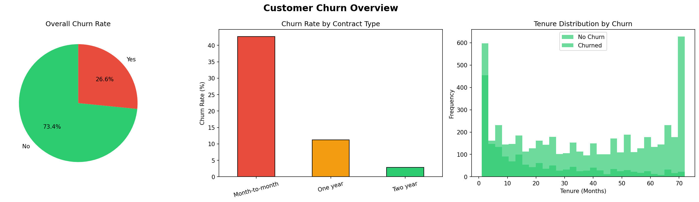
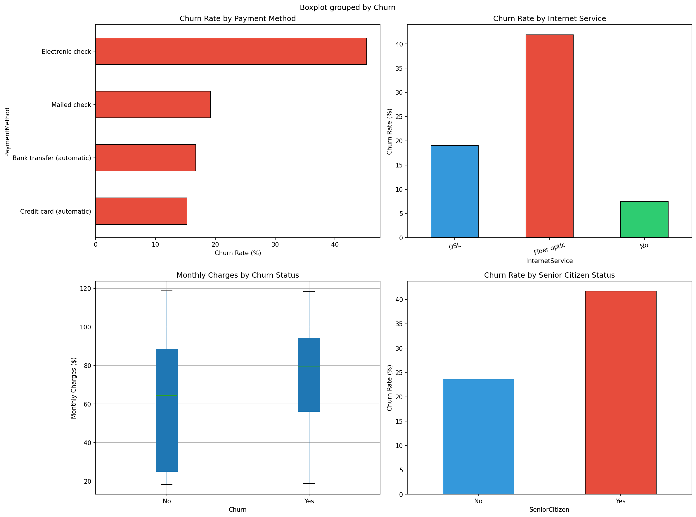
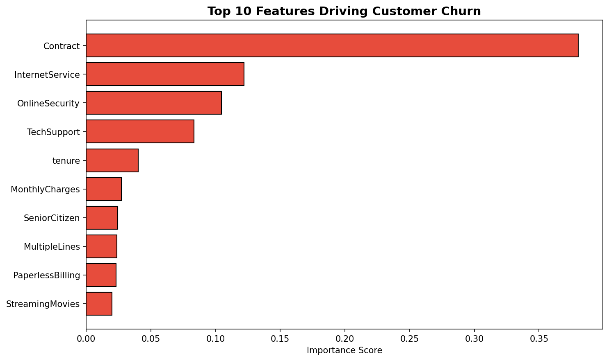

# Customer Churn & Revenue Intelligence Analysis

## 📊 Project Overview
Analyzed 7,032 telecom customers to identify **$139,131/month** in revenue at risk from churn. Delivered actionable retention strategies through SQL analysis, predictive modeling, and visual insights.

## 🎯 Key Business Findings
- Overall churn rate: **26.58%**
- Month-to-month customers churn at **42.71%** vs only **2.85%** for two-year contracts
- **47.68%** of customers churn within their first 12 months
- Churned customers leave after avg **18 months** vs 37.7 months for retained customers

## 💡 Business Recommendations
1. Offer loyalty discounts to month-to-month customers at month 6
2. Incentivize annual contracts for new customers in first 12 months
3. Upsell TechSupport and OnlineSecurity — customers without these churn significantly more
4. Focus retention budget on high-risk segment saving up to $139K/month

## 🛠️ Tools & Technologies
- **Python** — Pandas, NumPy, Matplotlib, Seaborn
- **Machine Learning** — XGBoost, Scikit-learn (79% accuracy)
- **SQL** — SQLite for business queries and segmentation
- **Data** — IBM Telco Customer Churn Dataset (7,032 records)

## 📁 Project Structure
```
├── churn_analysis.ipynb       # Main analysis notebook
├── data/
│   └── churn_cleaned.csv      # Cleaned dataset
├── sql/
│   ├── sql_contract_churn.csv
│   ├── sql_tenure_churn.csv
│   └── sql_payment_churn.csv
├── images/
│   ├── churn_overview.png
│   ├── churn_drivers.png
│   ├── feature_importance.png
│   └── confusion_matrix.png
```

## 📈 Visualizations
### Churn Overview


### Churn Drivers


### Feature Importance

